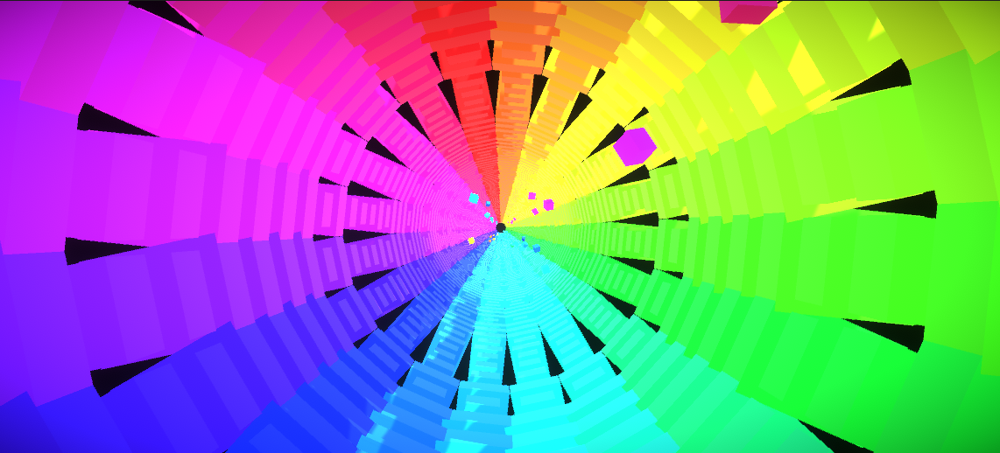
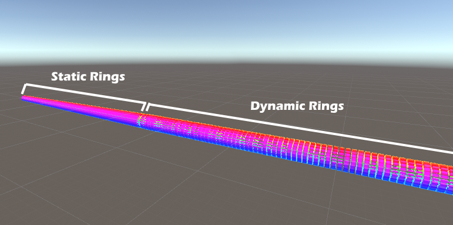
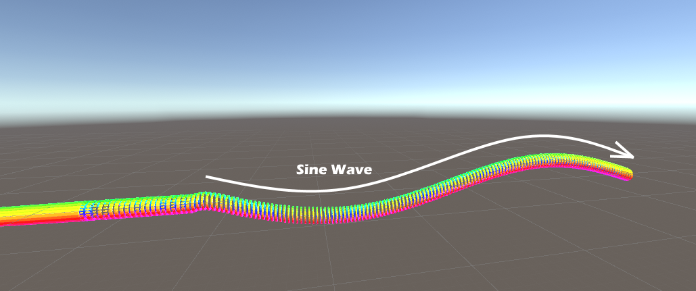

# Infinite Tunnel - Music Visualizer

Name: Damian Wojtowicz

Student Number: C17413722

Class Group: DT228/4

Video Link: https://youtu.be/XN0MpySX9eg

# Description of the project
The project is a procedularly generated music visualizer that shows an illusion of an infinite tunnel that the user moves through. The tunnel shrinks and expands with the beat and the speed at which the user moves through the tunnel is also adjusted to the music. To futher add more depth, cubes spawn within the tunnel and pulsate in sync with the music.

# Instructions for use
Simply import the song that you would like to play into unity and select it in clip field in the AudioAnalyzer object's AudioAnalyzer Script, then hit play. 
There are configurable variables for each of features in the project. For example, the radius of the ring, number of segments, number of rings, speeds, starting times, intervals and many, many more.

# How it works
There are several features and these will be discussed below.  
1\. **Infinite tunnel** 
A ring spawner object spawns two types of rings. There are dynamic rings which will be moved to give the illusion that the user is moving into the tunnel (the main camera does does not move forward) and there are also static rings which are the the very end of the tunnel and help give the illusion that the tunnel is infinite without the need to spawn thousands of objects. This can be seen in the image below.  
The rings are moved by an audio visualizer at a speed that corresponds to the music to give the feeling of moving with the beat. The ring spawner object keeps track of the position of the most recent ring and spawns in a new ring when needed. 
It also syncs the position of the newly spawned ring to the one before so that there the gap between rings is always consistent. To further make the spawning robust, if the ring moves too far whether due to lag or simply a high speed then multiple rings will spawn and the tunnel will always be consistent. 
The rings are destroyed as new ones spawn in and the ring is no longer in the FOV. The memory is freed up and this prevents lag caused by excess objects. 
The segments of each ring shrink and expand with the frequency bands, creating an interesting visual effect.  
  

2\. **Pulsating Cubes** 
Cubes are randomly spawned within the tunnel and these cubes move with the tunnel towards the player. These cubes also pulse with the music's amplitude to give a more interesting visual effect. The colour of the cubes is determined by their position in the tunnel and this helps make the visualizer less chaotic. These cubes are destroyed once out of the camera's FOV. The size of the cubes and their scale with the music's amplitude etc. can be configured.  

3\. **Oscillating tunnel** 
At a defined time and interval the tunnel forms into a shape of a sine wave and give creates the illusion of moving up and down a bending tunnel. The sideways view can be seen in the image below. The tunnel gradually bends to form the wave and is gradually restored back to normal after a specified amount of time. The camera x-axis and y-axis is adjusted as the tunnel oscillates. In other words the camera is centered to the ring in the tunnel and the camera rotation is also changed to look into the tunnel as it changes. The pulsating cubes mentioned before are also automatically synced to the height of the tunnel and the size of the segments in the ring are temporairly changed to smoothen out the tunnel. The timing, duration, osciallation speed etc. can be configured.  
  

4\. **Audio Responsiveness in detail** 
As previously mentioned there are two types of audio data that is used to generate the movement in this project. 
**Amplitude:** 
The first is the amplitude, and it used in calculating the speed at which the rings are pushed forward towards the camera. It is also used in making the pulsating cubes within the tunnel expand and contract. 
**Frequency Bands:** 
A frequency band is used to change the size of the segments in a ring. I went with the second band which is 60-250 hertz and used to capture the bass. I think it looks good when the entire tunnel pulses at this frequency. 

5\. **Post Processing** 
I added vignette and bloom post processing effects to make the visualizer look a little more interesting.

# Which parts I developed
This project was very challenging as I pretty much coded the project from scratch which includes the tunnel generation, oscillation of tunnel, spawning and movement of pulsating cubes etc. without the help of online tutorials. This is mainly because I couldn't find any tutorials that showed how to create an infinite tunnel like mine. 
However, I cannot take credit for is the AudioAnalyser created by Dr. Bryan Duggan. The use of the AudioAnalyser has also been inspired by the labs and it was heavily modified to suit the needs of the project. I got inspiration for the procedure of spawning the tunnel and moving the objects towards the camera instead of moving the camera forward from my friend who was familiar with Unity. I was also inspired by the labs to create the rings and colour the segments by their position using the HSV colour space.

# References
Inspiration:
**Procedural Phyllotaxis - Unity/C# Tutorial [Part 5 - 3D Tunnel]**: 
https://www.youtube.com/watch?v=PwHANpTc87E&t=2s&ab_channel=PeerPlay 
This video gave me some ideas for how to generate the tunnel. Although, in this video the camera moves forward and the tunnel is generated in front of it.
  
**Generating sine wave with an object:** 
https://answers.unity.com/questions/434717/how-to-make-a-sine-wave-with-a-transform.html

# What I am most proud of in the assignment
I'm most proud of the tunnel generation.

# Proposal:
Assignment 1 of Games Engines 1 
Damian Wojtowicz 
C17413722 
DT228/4 

## Project Idea
The idea is to create an audio responsive procedurally generated tunnel that the camera will move through. 
I have several ideas for how the project will work and these are not entirely set in stone and will probably change as the project progresses. 
 

**Note:** The colours in the images are not representative of the final program.

The inital idea (Prototype 1) was to have an audio responsive ring that generates more rings at intervals and moves these rings futher away from the camera, creating a tunnel effect. The opacity of the ring will change as it moves further away. Additionally dots/shperes will spawn and copies of these dots will be created at intervals in similar fashion and move away from the original, creating a trailing effect. Although I couldn't capture it in the image due to my inexperience with drawing, the rings are supposed to look different from one another.
  
However, I wanted to explore the possibility of going through the tunnel itself. This could be the second stage of the music visualization when enough rings are generated to create a tunnel. The rings will can then switch to a state like in the second image (Prototype 2) where they are no longer opaque and ununiform. I plan to make the camera move through the tunnel at a speed relative to the beat. I also intend to scale the cubes within the tunnel and the rectangles that make up the rings to the beat. Dynamic colour changing will be experimented with as well to create an interesting visual experience.
  
I would also like to experiment with bending the tunnel if I have enough time.
  

### Prototype 1 (Drawing)

### Prototype 2 (Drawing)

## Research and Inspirations
#### Audio Visualizer Inspiration
 
https://www.youtube.com/watch?v=gHpxRv4MBBA&t=3s&ab_channel=KnukN  
The video features an audio responsive visualizer and the points of interest for me were the movement/speed of the camera in response to the music. I found that very interesting and seeing the effect it has on the experience makes me want to implement something similar. I also like the randomness of the cubes and their movements as it gives the visuals that random aspect which I personally enjoy. However, the visualizer was implemented in Processing 3, meaning I will have to figure out how to code it in Unity.
   

#### Audio Visualizer Tutorial #1
 
https://www.youtube.com/watch?v=wtXirrO-iNA&ab_channel=N3KEN  
Approximately knowing what I would like to create I began with looking at online tutorials that could help me get a better idea on the implementation. This video has taught me how to visual an audio spectrum and the basics for how it works.
   

#### Audio Visualizer Tutorial #2
 
https://www.youtube.com/watch?v=PzVbaaxgPco&ab_channel=RenaissanceCoders  
Although the last example was very helpful I wanted to get an even better idea of the implementation of an audio visualizer in Unity. This tutorial explains the various components and values that can be extracted from an audio source and how these can be put to use. This tutorial works with UI objects as opposed to 3D game objects like I am planing to, however, it was still very useful in understand how audio visualizing works and the concepts behind it.

#### Audio Visualizer Tutorial #3
https://forum.unity.com/threads/audio-visualization-tutorial-unity-c-q-a.432461/
This is a forum on unity with several videos explaining how audio visualization works in unity and in general. I found it helpful as well in better understanding how audio visualizing works.
